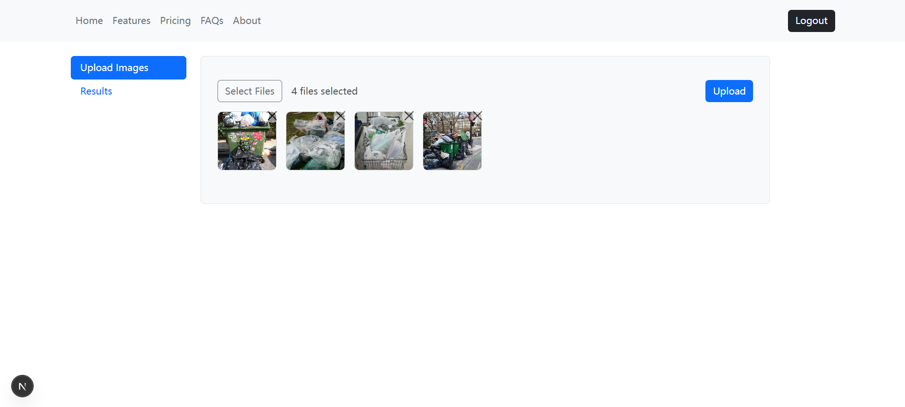
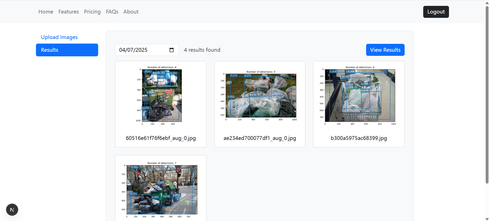

# Plastic Bag Waste Detection

## Getting Started
1. Train and deploy a model ResNet-50 or YOLOv8 on AWS Sagemaker.
2. Install packages for frontend and backend by `npm install`.
3. Complete the backend/.env file.
4. Run backend by `node server.js`. Run frontend by `npm run dev`.

## Example

